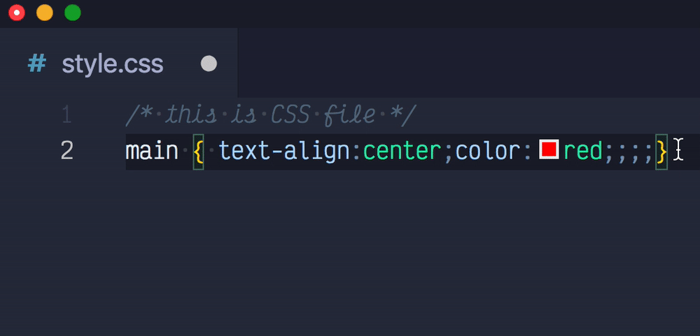
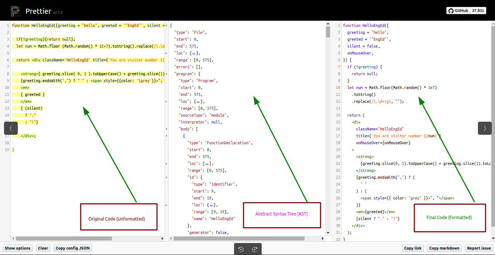
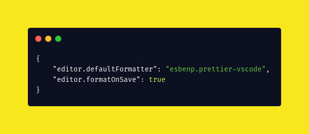
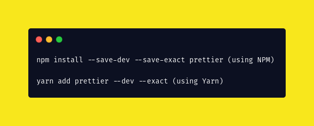
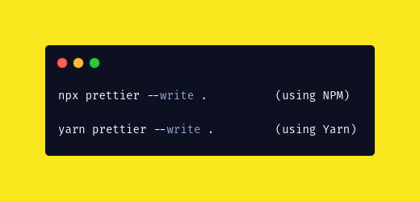
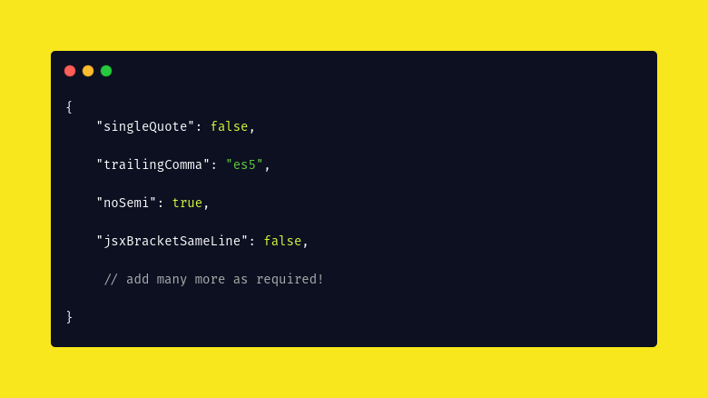
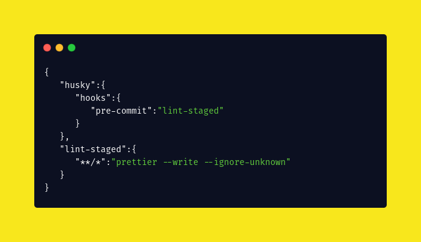

# How to setup code formatting of Node JS app using Prettier and ESLint?

 In open-source development, handling a large number of files across every development stage is a quite tedious task. These stages consist of enormous chunks of code that not only require a great amount of time for formatting but also differ in style with different individuals in the team. Have you ever wondered to cut short this formatting time with just one-click? Any alternatives to prevent this monotonous task? 
 
 For getting rid away with the hassles of writing clean code and maintaining consistency across a project on specific code style guidelines, **Prettier** is one of the most prominent tools out there in which you can bank upon! With Prettier and githook integration, you the code is formatted within a single-click. Prettier, along with the support of **ESLint**, is a deadly combination that increases productivity manifolds.

 This guide includes all the extensive information to get used to the code formatting style in the open source circuit. Let's get started by answering in-detail all the why(s), what(s) & how(s)!

## Table of Contents

- What is Prettier?
- Why is Prettier so useful?
- How does it work?
- How to install Prettier?
- How to configure Prettier to work with ESLint?
- How to format all your code with just one-click?
- Further Reading

## A Complete Roadmap

## What is Prettier?
  
Prettier is an opinionated code formatter with support for JavaScript, GraphQL, Angular and other popular Community Plugins. It is highly established in the open-source ecosystem with more than 2 million dependent repositories on GitHub. You can measure its efficiency by the fact that it has more than 6000 dependent packages on npm. Many of the technology giants like Facebook, React, Dropbox and PayPal, etc. use it quite extensively. It also has support for various IDE, viz. VS Code, Web Storm, Atom and Vim.


[Prettier Magic](https://glebbahmutov.com/blog/images/prettier/projectA.gif)

## Why is Prettier so useful?

- **Building and enforcing a style guide**: In open source development, having common style guidelines is a highly desirable feature in a project, but achieving that is a little tricky process. Prettier not only provides a perfect platform to build the style guide from scratch with suitable requirements but also helps in maintaining it throughout the life cycle of the project.

- **Saves you time and energy**: People usually spend a lot of time and mental energy formatting their code. Through Prettier, we can perform this monotonous task in a blink of an eye. It has been efficiently designed to solve the problem of formatting fatigue.

- **Hassle-free code reviews**: Using Prettier, we can safely ignore all style issues and focus on things that actually matter, like the structure and semantics of our code. Hence, they save a lot of time in code reviews. They keep everybody on the same page.

- **Easy to adopt & use**: Prettier is super easy to use. Even a beginner, with very limited programming experience, can quickly ramp up the things and get used to the code style. Setting Prettier up is a one time cost, but has long-time benefits.

- **One-click Optimization**: With proper configuration, you can use Prettier as a pre-commit githook to format all your files with just one-click. Supported with ESLint, you will be able to rectify syntax errors also.
   

[Supports multiple languages](https://glebbahmutov.com/blog/images/prettier/format-css.gif)

## How does it work?
- When code is run through Prettier, it removes all the formatting initially & and then according to the style guidelines reformatting of the code takes place. It scans all the files for style issues and automatically reformats the code to make sure that consistent rules are being followed for semicolons, indentation, line break, spacing, double quotes vs single quotes, etc.



- Internally, all the javascript code is converted into **Abstract Syntax Tree** (AST) and then formatted back. Hence, the abstract syntactic structure of source code is preserved. Initially, an abstract representation of this AST is generated and then all the commands are executed sequentially. For the user, everything gets formatted magically and he does not have to worry about all the processes. It is super fast and quite productive.

## How to install Prettier?

- Install the exact version of Prettier locally in your project. This will keep everybody on the same page, following the same rules. Even a slightly different version of Prettier may result in entirely different formatting, which may cause hinderance with different team members using different versions and formatting each other’s changes back and forth. 

- For this, first install prettier on your system. For installing it in your IDE/Editor, visit the extensions and download the corresponding plugin. In VS Code go to View ->Extensions, Search for prettier code formatter, Click Install. Go to **.vscode/settings.json**, that will open ide setting page in JSON format. Add the following snippet to format all the files with a single click:

```
  {
    "editor.defaultFormatter": "esbenp.prettier-vscode",
    "editor.formatOnSave": true
  }
```



- For installing prettier in projects, we will install the prettier CLI and add it as a dev dependency. Simply, go to the **VS Code** terminal and install the packages.

```
  npm install --save-dev --save-exact prettier (using NPM)
  yarn add prettier --dev --exact (using Yarn)
```


- Then, create an empty config JSON file (file A) and create a .prettierignore file (file B) to let editors and other tooling know you are using Prettier and which files to not format.

```
  echo {}> .prettierrc.json         ... File A
```

```
  # Ignore artifacts:          
  package-lock.json
  .next
  node_modules/                     ... File B
```

- Once you're done with writing your code files in the project, it's now time to format all the files you have. 

```
  npx prettier --write .    (using NPM)
  yarn prettier --write .   (using Yarn)
```


## How to configure Prettier to work with ESLint?

- ESLint is a programming tool that analyzes and checks source code. Apart from removing programming, indentation and formatting errors, it also removes bugs and undesirable practices in code formatting. The linting feature of ESLint & efficient formatting of Prettier is a deadly combination that increases productivity manifolds. To do the same, first install ESLint on your system. Here is a wonderful [tutorial](https://www.section.io/engineering-education/node-eslint/#eslint-and-node) you can refer to, for installing ESLint.

- After installing Prettier and ESLint, install the following packages: 

```
  npm i prettier eslint-config-prettier eslint-plugin-prettier -D
```


- Now, Update “extends” in your .eslintrc file as follows:

```
  "extends": [ "airbnb", "plugin:prettier/recommended" ]
```
- If you want to modify the default Prettier configuration, just create a **.prettierrc** file in *“eslint-app”* directory, for example:

```
  {
    // Use single quotes instead of double quotes.
    "singleQuote": false,

    /**
     * Print trailing commas wherever possible.
     * Valid options:
     *   - "none" - no trailing commas
     *   - "es5" - It prints trailing commas where valid in ES5 (ex: objects, arrays, etc)
     *   - "all" - It prints trailing commas wherever possible (ex: function arguments)
     */
    "trailingComma": "es5",
    
    /**
     * To not print the corresponding semicolons, except at the beginning of lines which may need them.
     * Valid options:
     * - true - It adds a semicolon at the end of every line
     * - false - It only adds semicolons at the very beginning of lines that introduce ASI failures
     */
    "noSemi": true,

    /**
     * To not print the spaces between brackets.
     * If false, puts the > of a multi-line JSX element at the end of the next line instead of being
     * alone on the last
     */
    "jsxBracketSameLine": false,
     
     // add many more as required!
    
  }
```


## How to format all your code with just one-click?

- Instead of running Prettier from the command line (prettier --write), checking formatting in CI, or running it from the editor, you can run Prettier as a pre-commit hook as well. This makes sure all your commits are formatted, without having to wait for your CI build to finish in a single click! 

- In order to do that, add the following snippet to your *package.json* to have ESLint and Prettier run before each commit, via [lint-staged](https://github.com/okonet/lint-staged) and [husky](https://github.com/typicode/husky)(Remember during lint-staged ESLint should be run before Prettier to keep the code format as it is in the actual order):

```
  {
    "husky": {
      "hooks": {
        "pre-commit": "lint-staged"
      }
    },
    "lint-staged": {
      "**/*": "prettier --write --ignore-unknown"
    }
  }
```


- And... **Voila!** With just a single click, you're done! Although setting these things up is a little tricky task but it just has *one-time* cost and the time-saving benefits compound over the period is quite worthy.

## Further Reading:
 
- [NPM Prettier](https://www.npmjs.com/package/prettierrc)
- [Prettier Configuration Docs](https://prettier.io/docs/en/configuration.html)
- [React JS App with ESLint + Prettier](https://medium.com/javascript-in-plain-english/set-up-react-js-with-eslint-prettier-and-airbnb-cc015363a7c7)

## About the Author
   - ***Aman Saxena*** is pursuing a degree in Computer Science. He has a keen interest in Competitive Programming & Web Development. He is fond of playing Cricket & solving Big-O complexities. When he’s not glued to a computer screen, he is likely exploring the mighty Universe. For any query or a fruitful discussion, you may connect with him on LinkedIn [@Aman](https://www.linkedin.com/in/amansaxena333/)

### Headshot = [Image](prettier-setup/Aman.jpg)
